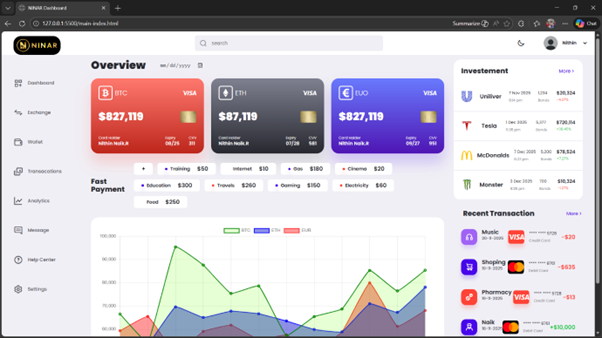
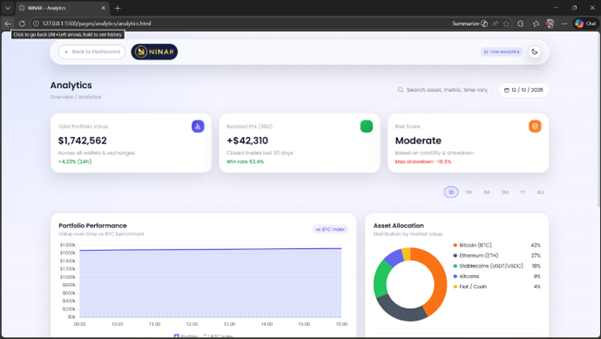
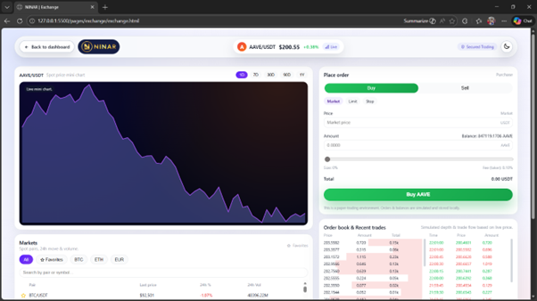
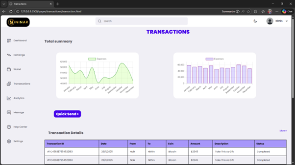
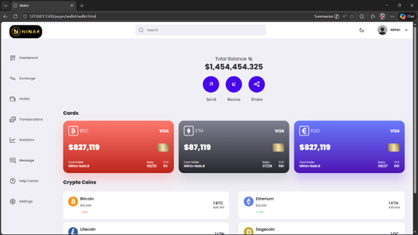
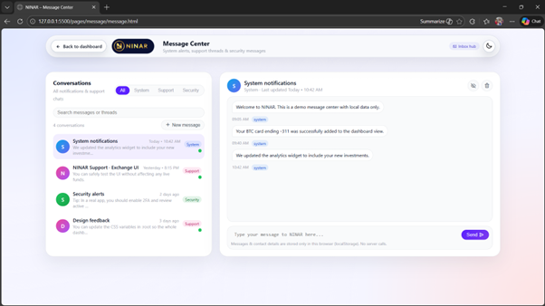
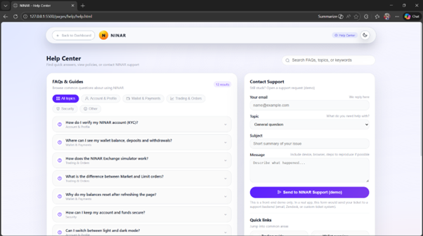
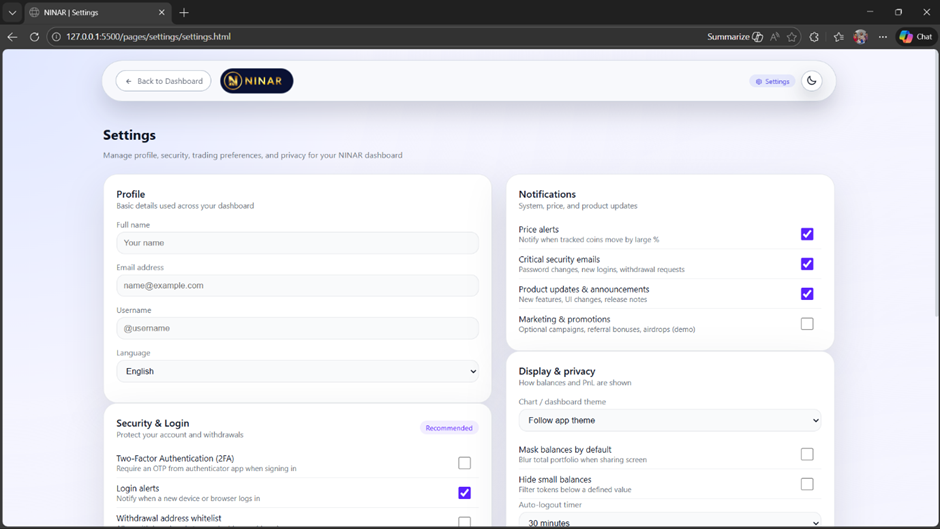

# Crypto Dashboard

A responsive crypto dashboard template built with HTML, CSS, and JavaScript.

This project provides a polished interface for viewing cryptocurrency analytics, market data, transactions, wallet details, messaging, and settings in one interactive dashboard.

## Features

- Clean dashboard layout with cards and charts
- Analytics page for portfolio overview
- Live-style market data and exchange page
- Transaction history and wallet management pages
- In-app messaging and help sections
- Responsive navigation across multiple dashboard views

## Pages Included

- `main-index.html` — Landing/dashboard overview
- `pages/analytics/analytics.html` — Analytics and portfolio insights
- `pages/exchange/exchange.html` — Exchange and market activity
- `pages/help/help.html` — Help and support information
- `pages/message/message.html` — Messaging interface
- `pages/send-recive/recive.html` and `pages/send-recive/send.html` — Send/receive crypto flows
- `pages/settings/settings.html` — User settings panel
- `pages/transactions/transaction.html` — Transaction history
- `pages/wallet/wallet.html` — Wallet overview

## Getting Started

1. Clone or download the repository.
2. Open `main-index.html` in your browser.
3. Navigate through the sidebar or pages to explore the dashboard.

## Usage

- Use the sidebar menu to switch between dashboard pages.
- View analytics and market performance from the analytics section.
- Monitor transactions and wallet balances in the transactions and wallet pages.
- Access help, settings, and messaging from their dedicated sections.

## Screenshots

### Dashboard

### Analytics

### Market / Exchange

### Transactions

### Wallet

### Messages

### Help

### Settings

## Built With

- HTML
- CSS
- JavaScript

## Notes

This dashboard is designed as a static front-end template and can be extended with real API data or backend services for a production release.

